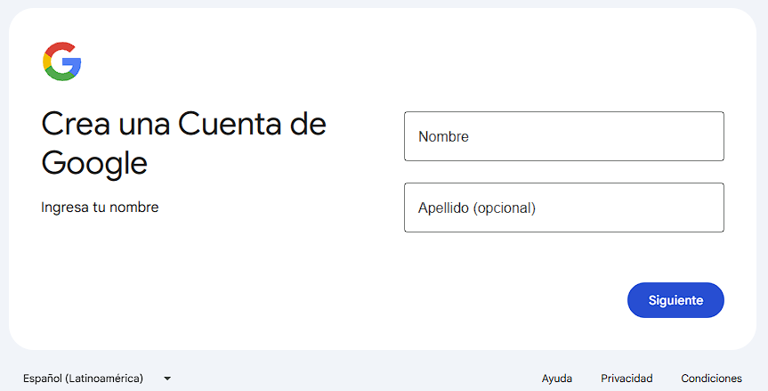

# Cómo acceder a la prueba gratituita con un crédito de US$300 para usar GCP

## Importante

* GCP utiliza un sistema de pago diferido mensualmente. Quiere decir que a fin de mes factura por los recursos utilizados a lo largo del mes por todos los proyectos asociados a la cuenta de facturación.
* Mientras no haya una cuenta de facturación asociada a un proyecto de GCP, no se pueden acceder a servicios que impliquen generación de gastos, ni siqueira aquellos correspondientes a la capa gratuita (free-tier).
* Las cuentas comienzan a facturar a nombre del cliente a partir del momento en que son "Activadas".
* Al comenzar el período de prueba, la cuenta no está formalmente "activada".
* Para activar una cuenta, el usuario debe explícitamente activarla. No sucede de forma automática.
* Cada cuenta de Gmail tiene derecho a acceder al beneficio de prueba gratuita con un saldo de regalo de US$ 300 durante 90 días sin ningún tipo de cargo a nuestro nombre. Para ello requiere una tarjeta de crédito o débito correctamente habilitada que esté asociada a la cuenta de facturación de GCP.
* Durante el período de prueba, veremos gastos realizados por los servicios utilizados, pero automáticamente lo veremos descontado en concepto de "promociones y otros créditos" y veremos cómo se ha restado del saldo de US$ 300, como muestra la imagen:Ningún cargo se hará sobre la tarjeta ni reserva del saldo, es simplemente para constatar que hay una persona detrás.
* Pasados los 90 días o el saldo llega a US$ 0, se suspenden todos los servicios asociados a la cuenta de facturación. No se genera ningún cargo por mantener instancias abiertas. A partir de este momento, se puede desvincular la tarjeta de la cuenta.
* Para desvincular un proyecto de una cuenta de facturación, primero hay que suspender todos los servicios activos de ese proyecto.
* Los proyectos permanencen mientras no generen gastos y pueden ser reutilizados al asociarlos a otra cuenta de facturación. Es decir, los proyectos persisten y se pueden activar/desactivar al asociar/desvincular una cuenta de facturación a ellos.

## Crear una cuenta de Gmail (opcional)

En caso de haber utilizado ya tu prueba gratuita de 90 días en tu cuenta de Gmail, puedes crear otra cuenta nueva para acceder nuevamente al beneficio.

## Ingresar a la Consola de GCP

A través de [http://console.cloud.google.com](http://console.cloud.google.com) accedemos a la Consola de GCP.
