# Cómo crear una instancia de máquina virtual

## Objetivo

La presente guía demuestra como crear una instancia de máquina virtual y cómo realizar la configuración incial.

## Tabla de contenido

* [Objetivo](https://github.com/datacloudclub/datacloudclub/blob/main/Google%20Cloud%20Platform%20(GCP)/Gu%C3%ADas/como_crear_vm.md#objetivo)
* [Creando una instancia](https://github.com/datacloudclub/datacloudclub/blob/main/Google%20Cloud%20Platform%20(GCP)/Gu%C3%ADas/como_crear_vm.md#creando-una-instancia)
* [Configurando la nueva máquina virtual](https://github.com/datacloudclub/datacloudclub/blob/main/Google%20Cloud%20Platform%20(GCP)/Gu%C3%ADas/como_crear_vm.md#configurando-la-nueva-m%C3%A1quina-virtual)
  * [Nombre, región y zona](https://github.com/datacloudclub/datacloudclub/blob/main/Google%20Cloud%20Platform%20(GCP)/Gu%C3%ADas/como_crear_vm.md#nombre-regi%C3%B3n-y-zona)
  * [Serie y tipo de máquina](https://github.com/datacloudclub/datacloudclub/blob/main/Google%20Cloud%20Platform%20(GCP)/Gu%C3%ADas/como_crear_vm.md#serie-y-tipo-de-m%C3%A1quina)
  * [Disco duro y sistema operativo](https://github.com/datacloudclub/datacloudclub/blob/main/Google%20Cloud%20Platform%20(GCP)/Gu%C3%ADas/como_crear_vm.md#disco-duro-y-sistema-operativo)
  * [Configuraciones avanzadas de dirección IPv4 externa estática](https://github.com/datacloudclub/datacloudclub/blob/main/Google%20Cloud%20Platform%20(GCP)/Gu%C3%ADas/como_crear_vm.md#configuraciones-avanzadas-de-direcci%C3%B3n-ipv4-externa-est%C3%A1tica)
  * [Finalizar la configuración y crear la instancia](https://github.com/datacloudclub/datacloudclub/blob/main/Google%20Cloud%20Platform%20(GCP)/Gu%C3%ADas/como_crear_vm.md#finalizar-la-configuraci%C3%B3n-y-crear-la-instancia)

## Creando una instancia

Podemos ingresar desde la Consola de GCP: [http://console.cloud.google.com](http://console.cloud.google.com).

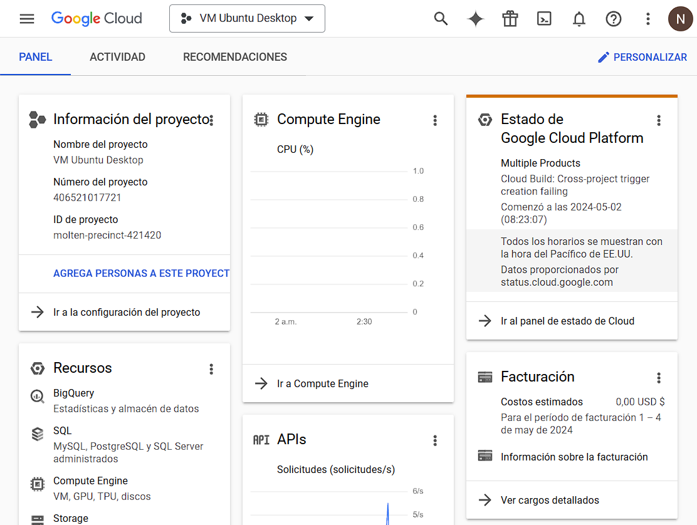

En el botón de tres líneas horizontales de la parte superior izquierda vamos a encontrar el Menú de Navegación por los servicios:

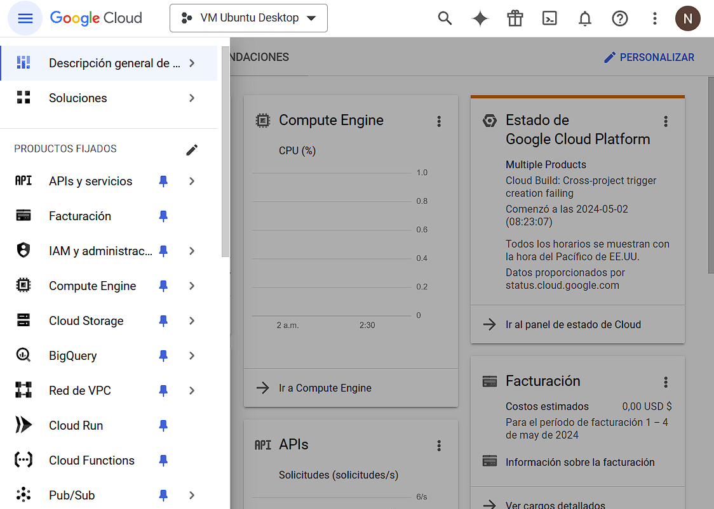

Al final de la lista encontraremos la opción de ver todos los productos por si Compute Engine no aparece en la lista

Seleccionamos Compute Engine:

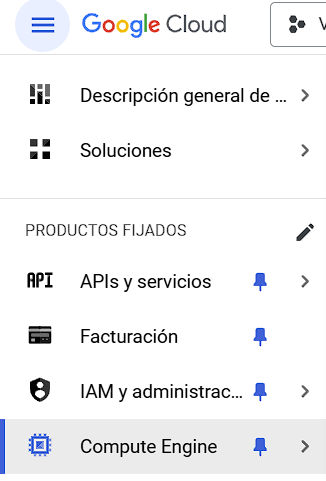

La primera vez que intentemos ingresar en nuestro proyecto, deremos habilitar la API del servicio de Compute Engine para poder hacer uso de todas sus funcionalidades y crear una máquina virtual.

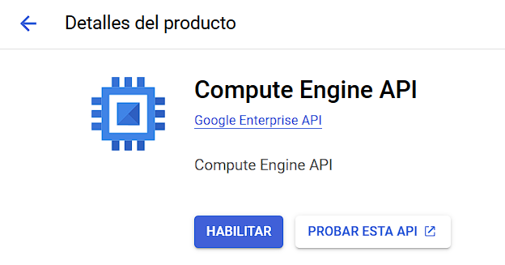

Una vez que se encuentre habilitada la API, vamos a poder utilizar el servicio.

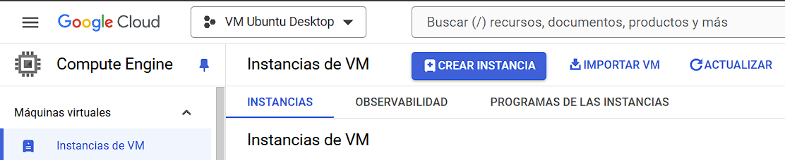

Dentro de Compute Engine, en Instancias de VM que es el servicio que se muestra de forma predeterminada, hacemos click sobre "Crear Instancia" para crear una nueva máquina virtual.

[volver a la Tabla de contenidos](https://github.com/datacloudclub/datacloudclub/blob/main/Google%20Cloud%20Platform%20(GCP)/Gu%C3%ADas/como_crear_vm.md#tabla-de-contenido)

## Configurando la nueva máquina virtual

### Nombre, región y zona

La máquina virtual puede ser modificada posteriormente en cuanto a la cantidad de procesamiento y memoria que deseemos, la cantidad de memoria en el disco rígido asociado a ella, la configuración de la red e incluso su nombre.

Pero la elección de la región y la zona no puede ser modificada una vez creada la máquina virtual.

Elegimos:

* **Región**: us-central1 (Iowa)
* **Zona**: us-central1-a

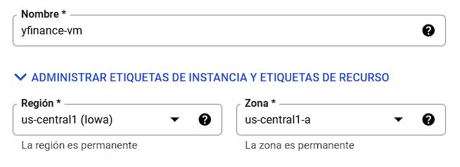

El motivo de esta elección es que todos los servicios de GCP funcionan en una zona. No todos los servicios están disponibles en todas las zonas, como por ejemplo sucede con Sudamérica San Pablo o Santiago.

De manera que si queremos hacer uso de todos los servicios, deberemos elegir una zona donde estén todos disponibles. Además los procesos se llevan a cabo de manera remota. Por lo tanto, la interconexión entre los servicios en la nube se hará íntegramente en Iowa.

[volver a la Tabla de contenidos](https://github.com/datacloudclub/datacloudclub/blob/main/Google%20Cloud%20Platform%20(GCP)/Gu%C3%ADas/como_crear_vm.md#tabla-de-contenido)

### Serie y tipo de máquina

La diferencia entre series depende de la cantidad de núcleos, la cantidad de memoria RAM y la potencia de las tarjetas gráficas asociadas a la máquina virtual.

En otras palabras, el precio que se paga por la máquina virtual, depende de la potencia que necesitemos.

De todas maneras, se puede modificar esta cantidad en cualquier momento posteriormente a su creación.

Elegimos la máquina E2 de tipo económico, es la Serie incluída en la capa gratuita.

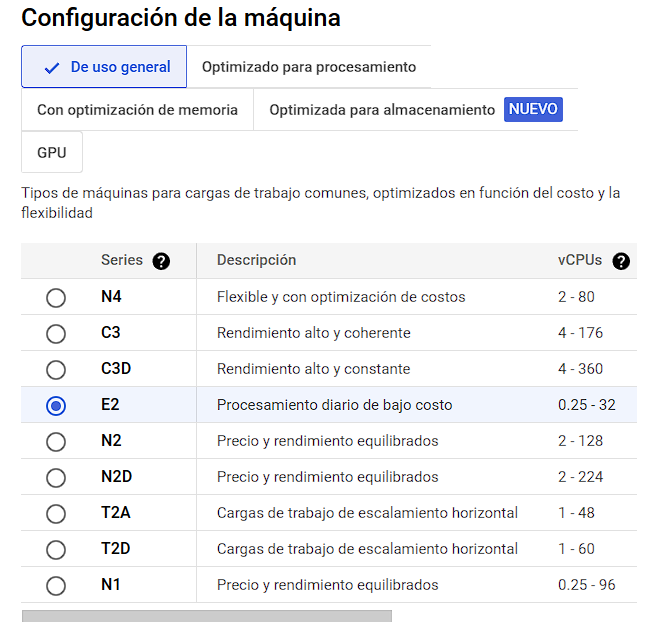

Nótese como al elegir distinto tipo de máquina, cómo varía el precio.

Tener en cuenta que el costo generado por la máquina virtual es mientras se encuentre encendida. Si la máquina virtual está apagada (se puede prender y apagar a voluntad) no genera gastos.

En cuanto al tipo de máquina, el tipo e2-micro está incluido en la capa gratuita.

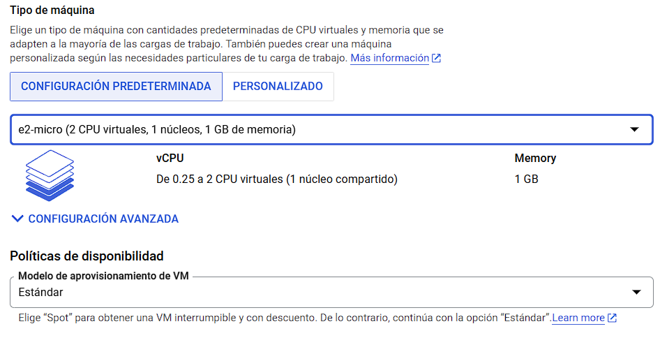

[volver a la Tabla de contenidos](https://github.com/datacloudclub/datacloudclub/blob/main/Google%20Cloud%20Platform%20(GCP)/Gu%C3%ADas/como_crear_vm.md#tabla-de-contenido)

### Disco duro y sistema operativo

Para cambiar el sistema operativo y el tamaño del disco, hacemos click en el botón "Cambiar"

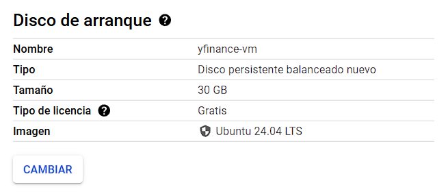

Elegimos la siguiente configuración:

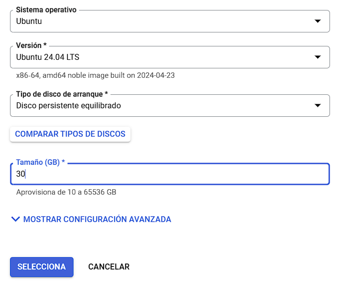

* **Sistema operativo:** Ubuntu
* **Versión:** 24.04 LTS (la versión más reciente, también se puede probar la 20, 22, 23)
* **Tipo de disco de arranque:** disco persistente equilibrado
* **Tamaño (GB):** 30

Hacemos click en seleccionar para cerrar la ventana y confirmamos que los cambios fueron realizados.

[volver a la Tabla de contenidos](https://github.com/datacloudclub/datacloudclub/blob/main/Google%20Cloud%20Platform%20(GCP)/Gu%C3%ADas/como_crear_vm.md#tabla-de-contenido)

### Configuraciones avanzadas de dirección IPv4 externa estática

Cada máquina virtual funciona con una dirección de IP interno de GCP, y una dirección de IP externa donde podemos conectarnos a ella vía remota.

La asignación de la dirección de IP es automática por ser "Efímera" es decir, que nos reserva una dirección IP global mientras la máquina esté encendida, pero al ser apagada, y luego reiniciada, la dirección de IP externa probablemente sea distinta.

Para asignarnos una dirección IP externa fija, desplegamos Opciones avanzadas, y luego en Herramientas de redes:

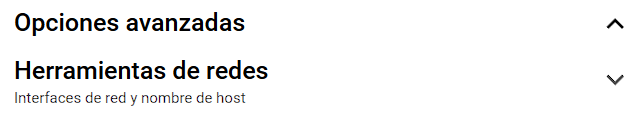

Buscamos donde dice Interfaces de red y desplegamos "default":

Casi en el fondo encontramos la dirección IPv4 externa, por definición es Efímera y también conviene elegir Nivel de servicio de red en Estándar para evitar cargos por el uso Premium de la red de alta velocidad de Google.

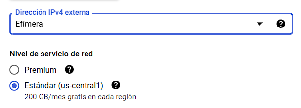

Haciendo click en dirección IPv4 externa podemos encontrar la opción para "Reservar dirección IP externa estática", para que sea fija.

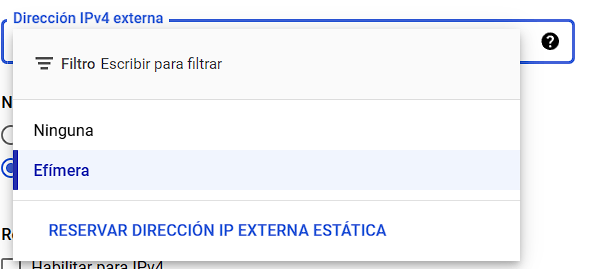

Al hacer click en "Reservar Dirección IP Externa Estática, veremos el siguiente recuadro donde debemos asignar nombre a la dirección de IP reservada:

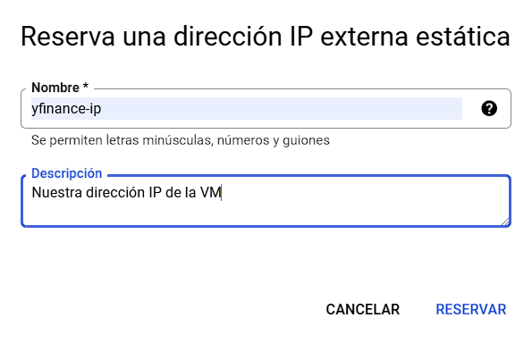

Una vez reservada la dirección de IP, podemos ver cómo queda asociada:

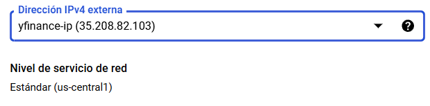

[volver a la Tabla de contenidos](https://github.com/datacloudclub/datacloudclub/blob/main/Google%20Cloud%20Platform%20(GCP)/Gu%C3%ADas/como_crear_vm.md#tabla-de-contenido)

### Finalizar la configuración y crear la instancia

Antes de finalizar, podemos revisar el prespuesto estimado teniendo en cuenta si estuviese la instancia siempre encendida y a plena capacidad de consumo:

Siempre es aconsejable tener en cuenta la página oficial con respecto a los precios: [Página de precios de Compute Engine](https://cloud.google.com/compute/all-pricing)

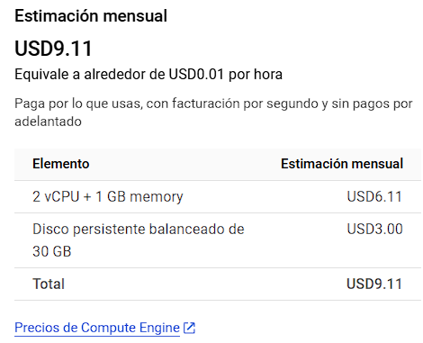

Para finalizar podemos hacer click en "Crear" para crear la instancia

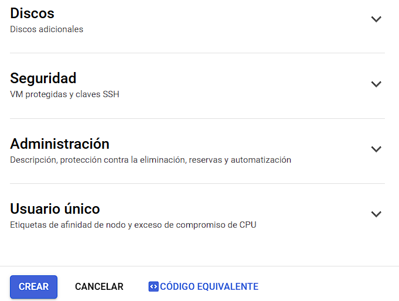

¡Felicitaciones! Hemos creado una instancia de máquina virtual.

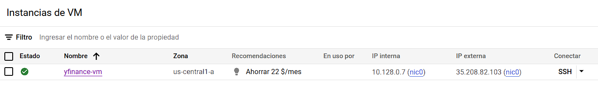

Nótese la siguiente configuración de la instancia (este es mi ejemplo, en su caso serán otros valores).

* **Dirección IP interna**: 10.128.0.7
* **Dirección IP externa**: 35.208.82.103

Tomar nota de las direcciones IP porque servirán para las diferentes conexiones que realicemos con la VM. De todas maneras siempre podremos regresar a esta página para revisarlas, o mediante el comando `gcloud compute instance list` en Terminal para que aparezca esta misma tabla.

Haciendo click en el botón **SSH**, se inicia en una ventana nueva la terminar para acceder a la instancia creada.

[volver a la Tabla de contenidos](https://github.com/datacloudclub/datacloudclub/blob/main/Google%20Cloud%20Platform%20(GCP)/Gu%C3%ADas/como_crear_vm.md#tabla-de-contenido)
