# Cómo conectarse a la instancia via SSH

## Objetivo

La presente guía muestra cómo generar las credenciales para conectarse a las instancias de VM mediante conexión segura SSH.

Ver documentación oficial: [Acerca de las conexiones SSH](https://cloud.google.com/compute/docs/instances/ssh?hl=es-419)

## Tabla de contenidos

* [Requisitos](https://github.com/datacloudclub/datacloudclub/blob/main/Google%20Cloud%20Platform%20(GCP)/Gu%C3%ADas/conexion_ssh.md#requisitos)
* [Generación de clave y credenciales](https://github.com/datacloudclub/datacloudclub/blob/main/Google%20Cloud%20Platform%20(GCP)/Gu%C3%ADas/conexion_ssh.md#generaci%C3%B3n-de-claves-y-credenciales)
* [Vincular las credenciales con Compute Engine](https://github.com/datacloudclub/datacloudclub/blob/main/Google%20Cloud%20Platform%20(GCP)/Gu%C3%ADas/conexion_ssh.md#vincular-las-credenciales-con-compute-engine)
* [Probemos ahora que podemos conectarnos a la instancia via SSH](https://github.com/datacloudclub/datacloudclub/blob/main/Google%20Cloud%20Platform%20(GCP)/Gu%C3%ADas/conexion_ssh.md#probemos-ahora-que-podemos-conectarnos-a-la-instancia-via-ssh)

## Requisitos

* Tener instalado Gcloud CLI: [Descarga e instalación de Gcloud CLI para conectarme de manera remota a los servicios en la nube](https://github.com/datacloudclub/datacloudclub/blob/main/Google%20Cloud%20Platform%20(GCP)/Gu%C3%ADas/gcloud_cli_install.md)
* Tener sesión iniciada en `gcloud` de lo contrario, hacer `gcloud init` e iniciar sesión en el proyecto que se quiera aplicar las credenciales.

[volver a la Tabla de contenidos](https://github.com/datacloudclub/datacloudclub/blob/main/Google%20Cloud%20Platform%20(GCP)/Gu%C3%ADas/conexion_ssh.md#tabla-de-contenidos)

## Generación de claves y credenciales

Seguiremos el procedimiento que figura en la documentación oficial para generar una clave SSH pública y privada que nos permitirá conectarnos con la instancia.

Para más información, consultar la documentación oficial: [Crea claves SSH](https://cloud.google.com/compute/docs/connect/create-ssh-keys?hl=es-419#windows-10-or-later)

Allí podemos encontrar el siguiente comando necesario para producir las credenciales.

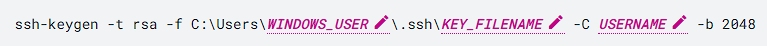

Para ejecutar este comando, abrimos la Terminal:

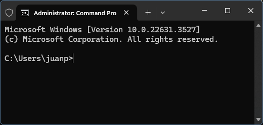

En Windows, el directorio por defecto que abre nuestra terminal es C:\Users\ ## nombre de usuario ##>

Si no nos encontramos en el directorio del usuario o no sabemos cual es, podemos ingresar `cd %USERPROFILE%` para llegar a él y luego `cd .ssh`

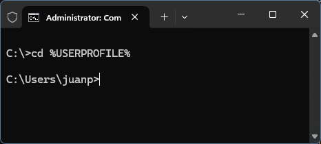

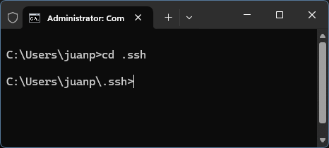

Si el directorio .ssh no existe, primero deberemos crearlo usando `md .ssh` y luego `cd .ssh`

Siguendo las instrucciones debemos escribir nombre del archivo y nombre de usuario con el que ingresaremos mediante la conexión SSH.

* Nombre del archivo: gcp
* Nombre de usuario: DCC

Debemos escribir  `ssh-keygen -t rsa -f gcp -C DCC -b 2048` que significa que en la carpeta actual se creará la clave privada cuyo nombre será gcp

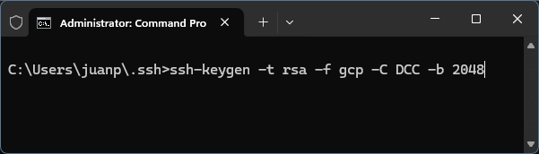

Nos va a pedir ingresar una contraseña, la podemos dejar en blanco y apretar ENTER. Luego hay que confirmar la contraseña.

Finalmente emite las credenciales:

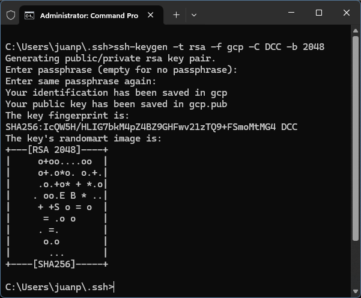

Quiere decir que ahora tenemos dos credenciales, una privada llamada `gcp` que nunca debemos exhibir, y la pública llamada `gcp.pub`

[volver a la Tabla de contenidos](https://github.com/datacloudclub/datacloudclub/blob/main/Google%20Cloud%20Platform%20(GCP)/Gu%C3%ADas/conexion_ssh.md#tabla-de-contenidos)

## Vincular las credenciales con Compute Engine

La credencial pública la tenemos que insertar en Compute Engine para que reconozca el ingreso mediante SSH.

En la Consola de GCP, vamos al apartado de Compute Engine y en la sección de Configuración, ingresamos a "Metadatos"

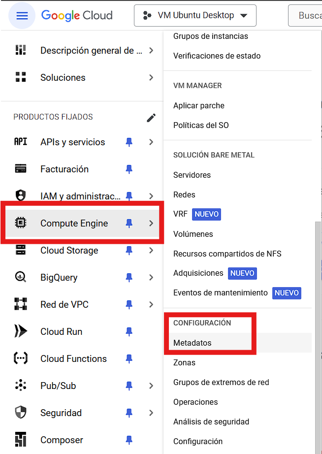

En Metadatos hacemos click en "Claves SSH"

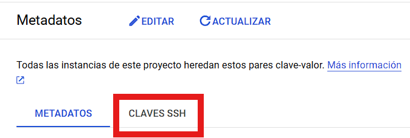

Hacemos click en "Editar" y en "+ Agregar elemento"


Volvemos a la terminal, editamos el archivo `gcp.pub` correspondiente a la clave pública creada anteriormente.

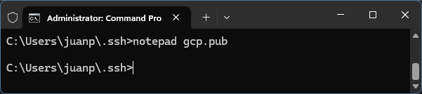

Y encontramos:

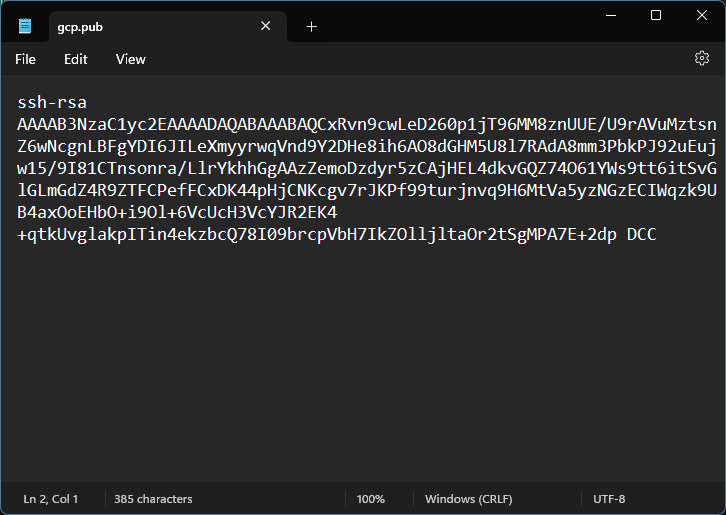

Seleccionamos todo el texto y lo pegamos en Clave SSH 1 y hacemos click en "Guardar":

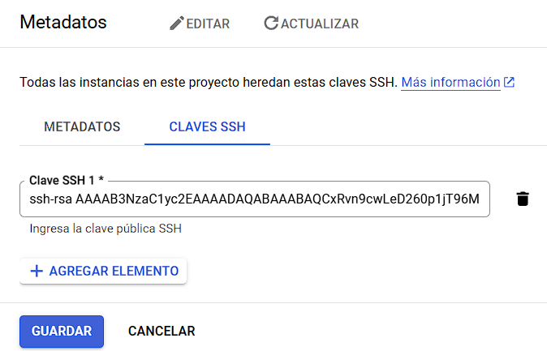

## Generar el archivo `config` para la conexión remota SSH

Por último, nuevamente en la terminal abrimos el block de notas para crear el archivo llamado `config` de la siguiente manera `notepad config`

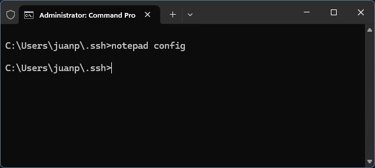

Allí deberemos escribir los datos para conectarnos a la instancia.

Debemos asignar:

* Nombre a la conexión: en este caso, yfinance
* Dirección externa de IP: en este caso, 34.135.38.214
* Nombre de usuario (el mismo usado para crear la clave): en este caso, DCC
* Ubicación del archivo de la clave privada: en este caso, `C:/users/juanp/.ssh/gcp` (en tu caso en lugar de juanp, es el nombre de la carpeta de tu usuario)

```
Host yfinance
    HostName 34.135.38.241
    User DCC
    IdentityFile C:/users/juanp/.ssh/gcp
```

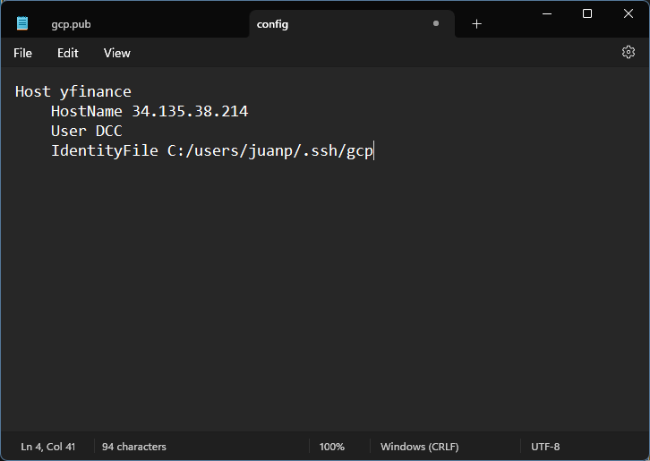

De esta manera. Apretamos CTRL + S para guardar, o Archivo > Guardar.

## ¡Y listo! Hemos logrado configurar la conexión SSH

[volver a la Tabla de contenidos](https://github.com/datacloudclub/datacloudclub/blob/main/Google%20Cloud%20Platform%20(GCP)/Gu%C3%ADas/conexion_ssh.md#tabla-de-contenidos)

## Probemos ahora que podemos conectarnos a la instancia via SSH

Para ello primero verificamos que la instancia está iniciada. En la terminal ingresamos `gcloud compute instances list`

Recordemos que de no haber configurado una dirección de IP externa estática, debermos cambiar el archivo `config` cada vez que apaguemos e iniciemos la instancia.

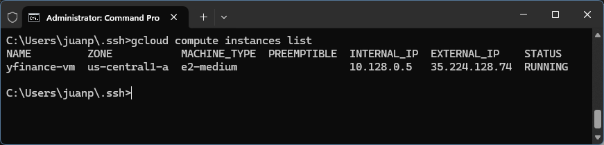

Dado que cambió la dirección IP externa, entonces en el directorio .ssh (`cd %USERPROFILE%/.ssh`) hacemos `notepad config`

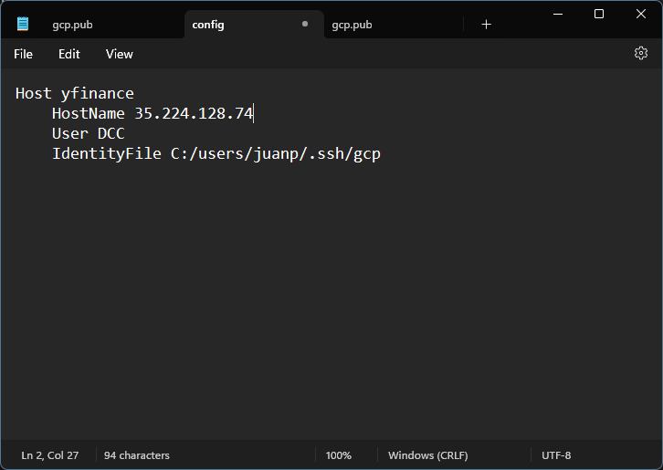

Cambiamos la dirección IP y ponemos la actual.

Ahora si, en la terminal basta con hacer ssh y el nombre de Host, en este caso nosotros declaramos que se llamaría yfinance: `ssh yfinance`

Nos preguntará si queremos dejar la huella de nuestro ingreso y agregar nuestra dirección de IP de nuestra computadora local para que acceda mediante SSH a la instancia:

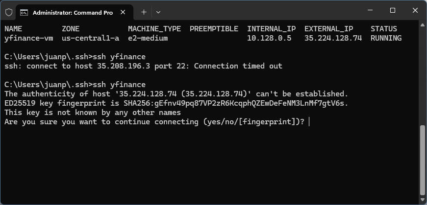

Ponemos "yes":

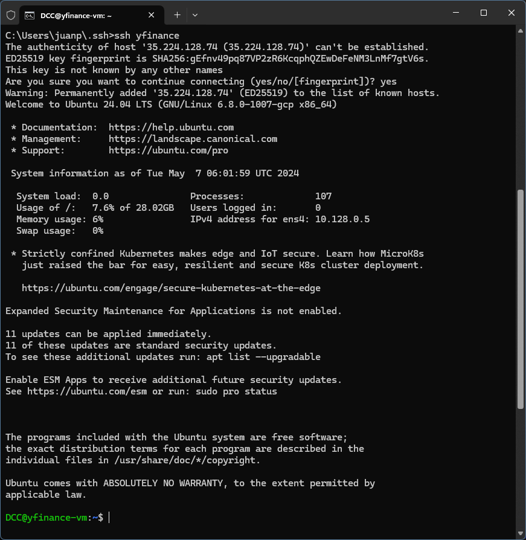

Estaremos conectados directamente a la instancia. Fíjese que ahora en la terminal figura el nombre de usuario declarado en la clave SSH: DCC y el nombre de la instancia: yfinance-vm.

[volver a la Tabla de contenidos](https://github.com/datacloudclub/datacloudclub/blob/main/Google%20Cloud%20Platform%20(GCP)/Gu%C3%ADas/conexion_ssh.md#tabla-de-contenidos)
