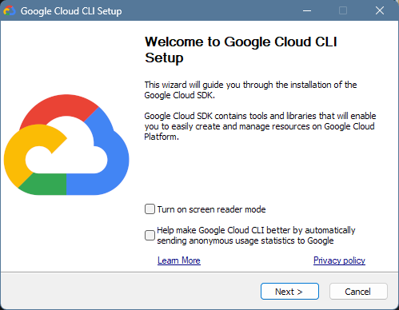
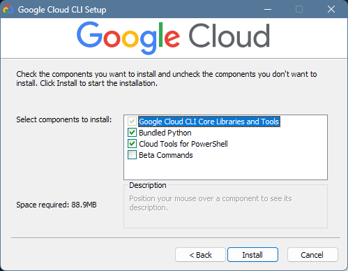
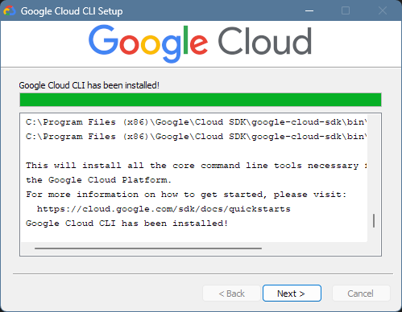
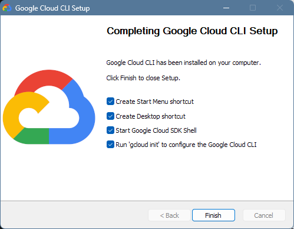
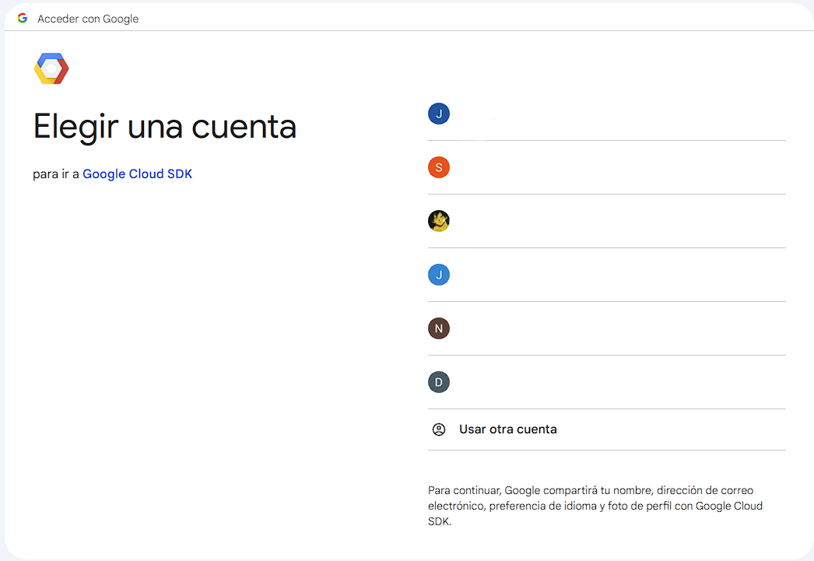
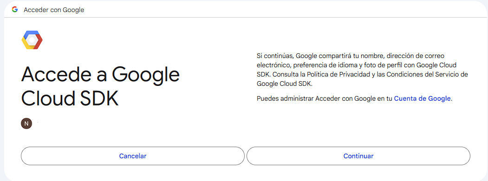
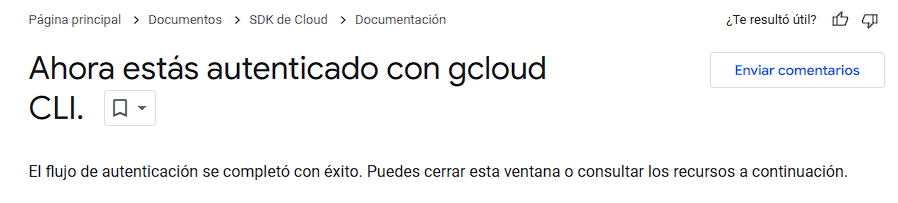
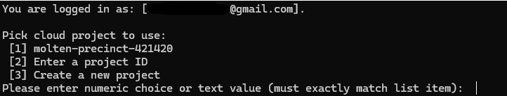
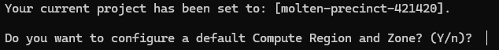

# Descarga e instalación de Gcloud CLI para conectarme de manera remota a los servicios en la nube

## Objetivo

La presente guía muestra cómo utilizar las herramientas de desarrollador de Google Cloud SDK, en particular la interfaz de cliente Gcloud CLI.

Para más información, ver [la página de documentación oficial del Google Cloud SDK](https://cloud.google.com/sdk?hl=es-419).

Para ver la lista completa de comandos de `gcloud`: [ver documentación oficial del comando gcloud](https://cloud.google.com/sdk/gcloud/reference)

## Tabla de contenidos

* [Descarga de Gcloud CLI](https://github.com/datacloudclub/datacloudclub/blob/main/Google%20Cloud%20Platform%20(GCP)/Gu%C3%ADas/gcloud_cli_install.md#descarga-de-gcloud-cli)
* [Instalación de Gcloud CLI](https://github.com/datacloudclub/datacloudclub/blob/main/Google%20Cloud%20Platform%20(GCP)/Gu%C3%ADas/gcloud_cli_install.md#instalaci%C3%B3n-de-gcloud-cli)
* [Comandos útiles para inicio de sesión](https://github.com/datacloudclub/datacloudclub/blob/main/Google%20Cloud%20Platform%20(GCP)/Gu%C3%ADas/gcloud_cli_install.md#comandos-%C3%BAtiles-para-inicio-de-sesi%C3%B3n)

## Descarga de Gcloud CLI

Descargamos Gcloud CLI mediante el [siguiente link](https://dl.google.com/dl/cloudsdk/channels/rapid/GoogleCloudSDKInstaller.exe?hl=es-419).

## Instalación de Gcloud CLI

Para iniciar la instalación, ejecutamos el archivo descargado y veremos la siguiente pantalla:

La instalación es bastante sencilla, basta con darle siguiente a todas las ventanas hasta llegar a la última ventana previo a la instalación. Hacemos click en "Instalar" y comenzará la instalación.

Y la instalación fue realizada con éxito:

Hacemos click en "Siguiente" y por último en "Finalizar" para que el instalador ejecute el comando `gcloud init` para iniciar sesión en la cuenta de GCP.

Se abre una sesión en la terminal y debemos iniciar sesión en la cuenta de Gmail asociada a GCP:

Y deberemos aceptar los términos y condiciones:

Finalmente si el proceso fue exitoso, veremos este mensaje:

Mientras, en la sesión de la terminal abierta, ahora ya iniciada la sesión, nos pide el proyecto que queremos usar:

Allí seleccionamos el nombre del proyecto al que queremos ingresar, en este caso 1.

Después nos pregunta si queremos definir una Región y Zona por defecto, decimos que sí y elegimos la zona 8 (us-central1-a):

## ¡Y listo! Ya tenemos la línea de comando Gcloud CLI correctamente instalada y asociada al proyecto que queremos trabajar.

[volver a Tabla de contenidos](https://github.com/datacloudclub/datacloudclub/blob/main/Google%20Cloud%20Platform%20(GCP)/Gu%C3%ADas/gcloud_cli_install.md#tabla-de-contenidos)

## Comandos útiles para inicio de sesión

Se provee de una pequeña lista de comandos de `gcloud` para aquellas circunstancias que estemos trabajando con distintos usuarios y proyectos en simultáneo.

Es importante remarcar que cambiar de proyecto a través de la página web en la Consola de GCP, no cambia el proyecto o usuario en `gcloud` y para ello es necesario conocer los siguientes comandos:

* Para iniciar sesión con Gmail a GCP: `gcloud auth login`
* Para cerrar sesión en GCP: `gcloud auth revoke`
* Para ver la lista de proyectos y verificar el proyecto activo: `gcloud config list`
* Para reiniciar la conexión con GCP, cambiar de usuario o de proyecto: `gcloud init`

[volver a Tabla de contenidos](https://github.com/datacloudclub/datacloudclub/blob/main/Google%20Cloud%20Platform%20(GCP)/Gu%C3%ADas/gcloud_cli_install.md#tabla-de-contenidos)
