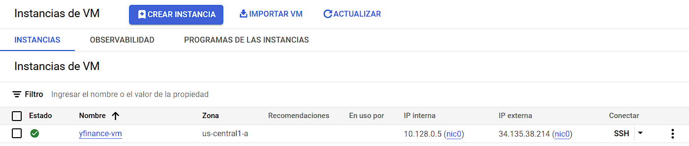
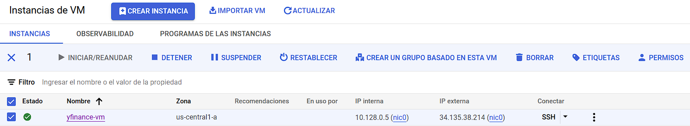
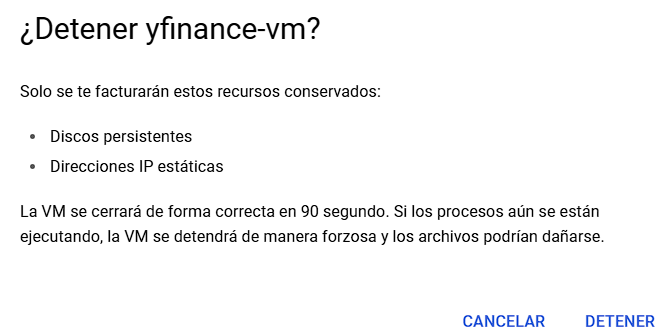
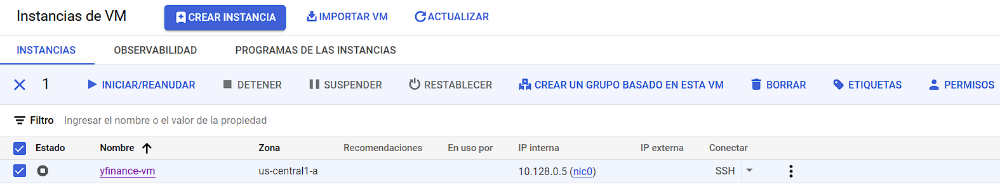
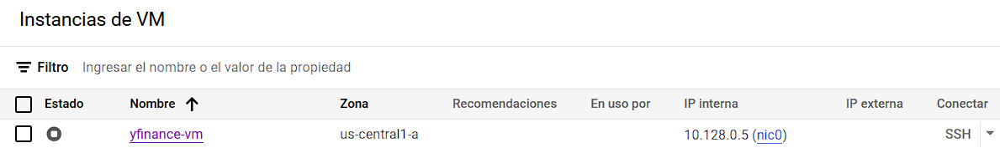
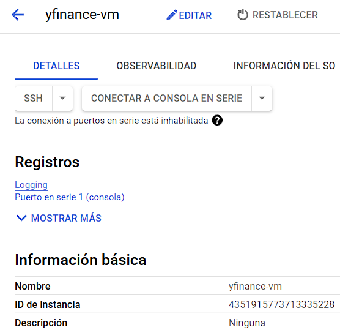
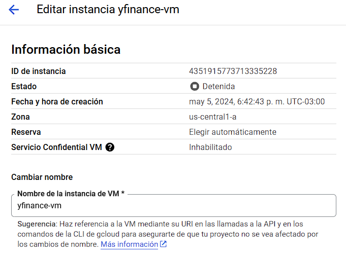
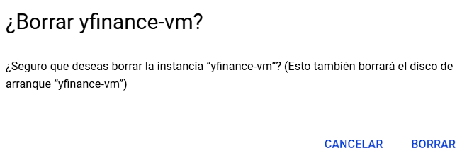
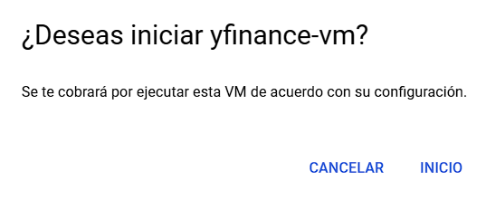

# Administrar una instancia de máquina virtual

## Objetivo

La presente guía demuestra cómo detener, modificar, eliminar e iniciar una instancia de máquina virtual ya creada.

## Tabla de contenido

* [Objetivo](https://github.com/datacloudclub/datacloudclub/blob/main/Google%20Cloud%20Platform%20(GCP)/Gu%C3%ADas/como_crear_vm.md#objetivo)
* [Detener una instancia]()
* [Editar una instancia]()
* [Eliminar una instancia]()
* [Iniciar una instancia]()

## Detener una instancia

Para detener una instancia y así prevenir el consumo y gasto por parte de una instancia de máquina virtual, debemos seleccionar la instancia que queremos detener:

Y apretamos en la opción de "Detener" para detener la instancia.

Recibimos el siguiente recordatorio, mientras la instancia de VM esté detenida, no generará cargos. Pero sí generarán cargos, los discos persistentes (creados al momento de creación de la instancia) y las direcciones IP externas estáticas, si hubiera.

Hacemos click en "Detener" para detener la instancia.

El Estado en forma de cuadrado blanco en un círculo gris (a diferencia del tilde verde) implica que la instancia está detenida.

La dirección IP externa al no ser estática desaparece. Si hubiesemos configurado una dirección de IP externa estática, detenida la instancia, todavía permanecería la IP externa al igual que la interna.

Mientras la instancia esté detenida, no es posible acceder a ella vía SSH.

Algunas modificaciones en su configuración y la eliminación de la instancia, ambas requieren que la instancia esté detenida.

volver a Tabla de contenido

## Editar una instancia

Para editar una instancia, basta hacer click sobre su nombre:

Allí accedemos a las propiedades de la instancia:

Y haciendo click sobre el lapiz "Editar" vamos a poder editar la configuración de la instancia:

Aquí lo único que no vamos a poder cambiar es la zona y región de la instancia. Luego desde el nombre, serie de computadora, capacidad de disco persistente, sistema opertativo, vamos a poder modificar aquí una vez creada la instancia.

## Eliminar una instancia

Para eliminar una instancia, la misma debe estar detenida. Seleccionamos la instancia que deseamos eliminar:

Hacemos click sobre el botón "Borrar" y recibimos la siguiente advertencia:

Al hacer click sobre "Borrar" comenzará la eliminación de la instancia y, dependiendo de la configuración inicial, también eliminará el disco asociado a la misma.

## Iniciar una instancia

Para iniciar una instancia detenida, seleccionamos la instancia detenida:

Hacemos click sobre el botón "Iniciar/Reanudar", y nos recuerda que iniciar una instancia viene con un costo asociado según su configuración. Damos click sobre "Inicio" para iniciar la instancia.

