# Cómo compartir mi proyecto con otras personas

## Objetivo

La presente guía muestra cómo compartir el presente proyecto con otras personas.

## Tabla de contenidos

* [Asignar un rol a otra cuenta](https://github.com/datacloudclub/datacloudclub/blob/main/Google%20Cloud%20Platform%20(GCP)/Gu%C3%ADas/uso_compartido_proyecto.md#asignar-un-rol-a-otra-cuenta)
* [Eliminar un rol asignado](https://github.com/datacloudclub/datacloudclub/blob/main/Google%20Cloud%20Platform%20(GCP)/Gu%C3%ADas/uso_compartido_proyecto.md#eliminar-un-rol-asignado)

## Asignar un rol a otra cuenta

En la consola de GCP: [http://console.cloud.google.com](http://console.cloud.google.com) nos dirigimos en el Menú de Navegación a IAM y administración:

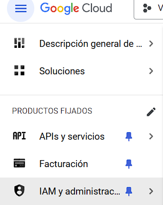

Aquí podemos ver los roles asignados:

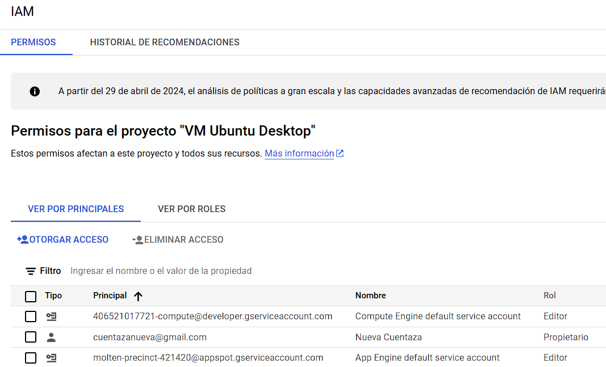

Para permitir a una persona pueda ver o realizar modificaciones al proyecto, le podemos asignar roles para darle acceso.

Hacemos click en "Otorgar acceso":

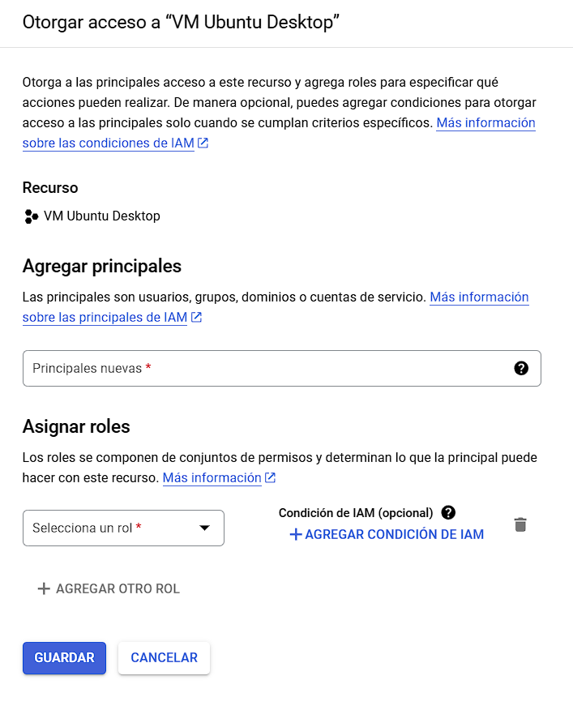

En Agregar principales, en "Principales nuevas *" escribimos el correo de Gmail de la persona que queremos autorizar.

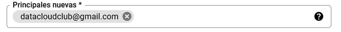

Luego le asignamos un rol:

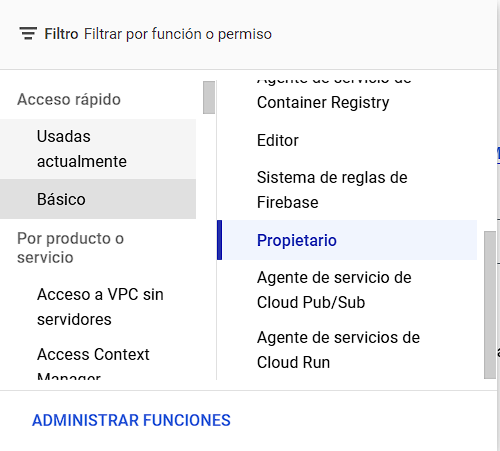

Para el presente caso, como es un conocido, le asignamos rol de "Propietario" para que tenga acceso completo a todos los recursos del proyecto, para que pueda crear nuevos recursos, eliminar otros, como si fuese el dueño de la cuenta.

Esta configuración pone en riesgo la integridad de la cuenta al dotar a otra persona con todas las habilidades del propietario, lo cual podría generar gastos sin nuestro control.

Se recomienda una lectura más detenida de los roles: [Referencias de IAM, roles básicos y roles predefinidos](https://cloud.google.com/iam/docs/understanding-roles).

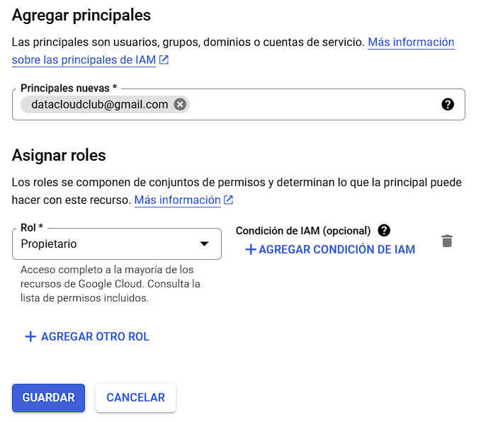

Hacemos click en "Guardar" y luego podemos ver la modificación en la lista de roles asignados. Al ver un signo de alerta, se refiere a que se le envió un correo a la persona invitada para que acepte el rol designado, y de esta manera pueda adquirir el nivel de permiso elegido.

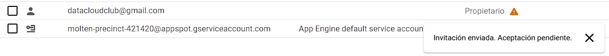

Un correo de estas características le llegará a la otra persona.

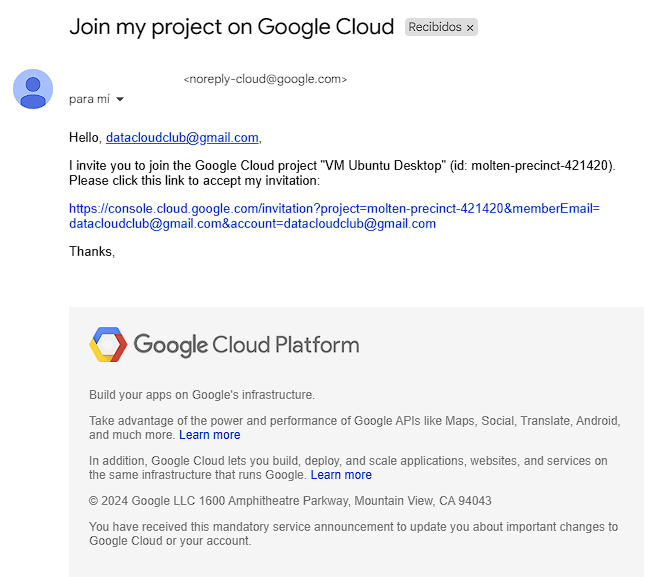

Al seguir el link enviado en el correo, nos llevará a GCP:

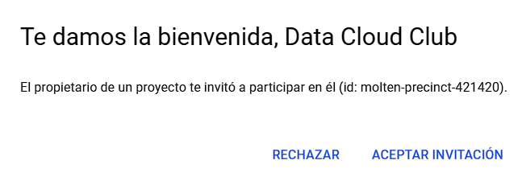

De esta manera, la otra persona va a poder ver al proyecto entre sus proyectos.

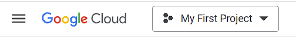

Haciendo click en la lista de proyectos podrá intercambiar entre proyectos.

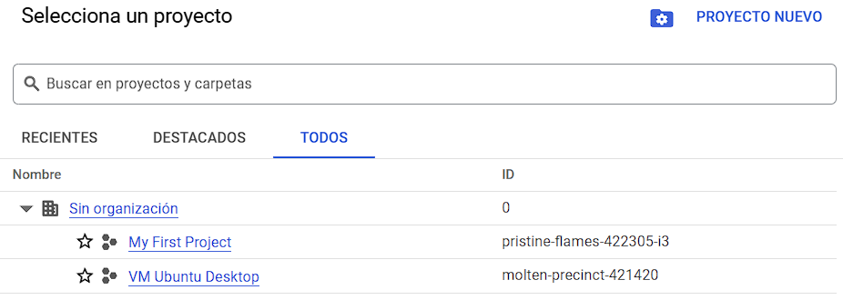

## ¡Y listo! Así otra persona también puede introducir cambios a nuestro proyecto

Se recomienda leer con detención los roles que existen para poder determinar la cantidad justa de roles que le otorgamos a la otra persona.

Recuerda que los roles pueden ser cambiados en cualquier momento por el propietario del proyecto.

[volver a la Tabla de contenidos](https://github.com/datacloudclub/datacloudclub/blob/main/Google%20Cloud%20Platform%20(GCP)/Gu%C3%ADas/uso_compartido_proyecto.md#tabla-de-contenidos)

## Eliminar un rol asignado

Seleccionando la cuenta principal, hacemos click en Eliminar acceso:

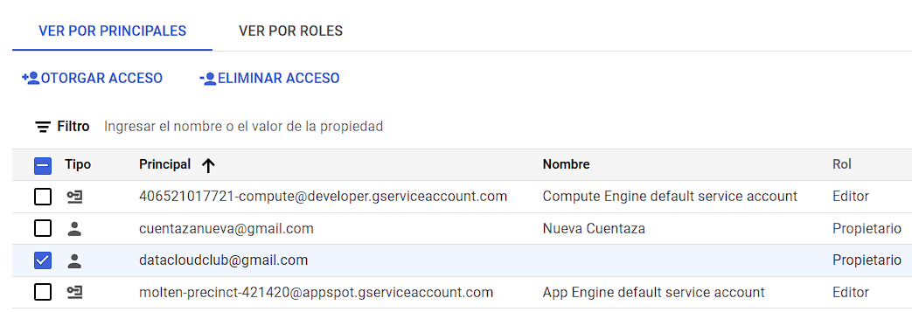

Nos preguntará si queremos quitar a la cuenta asociada:

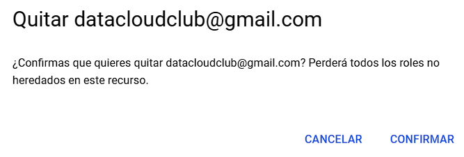

De esta manera se elimina el acceso de la cuenta:

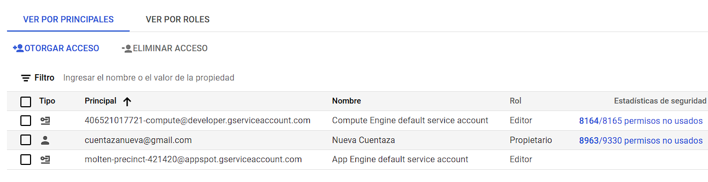

[volver a la Tabla de contenidos](https://github.com/datacloudclub/datacloudclub/blob/main/Google%20Cloud%20Platform%20(GCP)/Gu%C3%ADas/uso_compartido_proyecto.md#tabla-de-contenidos)
